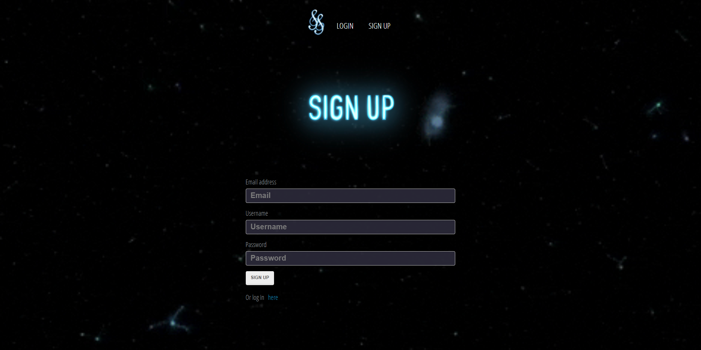

# STELLAR-SONIC

## User Story 
GIVEN I am trying to curate an interactive personal playlist
SIGNUP or LOGIN in order to be able to enter homepage
SEARCH for song title or song artist in search bar
WHEN I click "search" 
THEN the searched song title, artist, youtube video, and youtube link will appear on the page
WHEN I click "add to playlist" 
THEN the song will be added to the bubble chart 
WHEN I add more songs of the same genre
THEN the bubble will get bigger
WHEN there are less songs in a certain genre
THEN the bubble will appear smaller
WHEN I click the "Shoutbox" button
THEN the Stellar Sonic Shoutbox will open up 
WHEN I enter text into the chat and press send
THEN my message will be visible to all users on the site
WHEN I click "logout"
THEN I will be redirected to the login page

## Technologies Used
- Shazam API 
- D3 
- Procreate
- MySQL 

## Screenshots of Webpage

## Links 
- https://dry-shelf-60979.herokuapp.com/